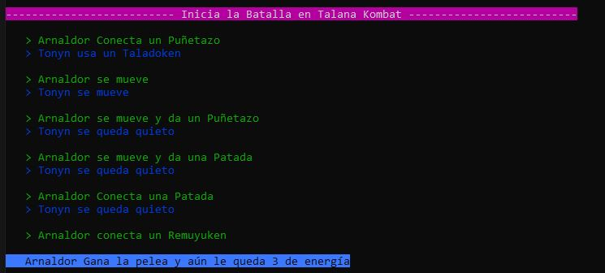

# talana_desafio

Desafío de programación desarrollado en Python

## Detalle de la solución

### Installing

#### DOCKER:
#### WINDOWS
- **PASO 0:** Ejecutar en la raiz 
    ```powershell
    python3 -m venv venv
    ```

- **PASO 1:** Ejecutar en powershell 

    ```powershell
    Set-ExecutionPolicy -ExecutionPolicy RemoteSigned -Scope CurrentUser
    ```

- **PASO 2:** Ejecutar 

    ```powershell
    .\venv\Scripts\Activate.ps1
    ```

- **PASO 3:** Ejecutar 

    ```powershell
    pip install -r requirements.txt
    ```

- **PASO 4:** Ejecutar

    ```powershell
    docker-compose up
    ```
    
    

#### MAC OS
- **PASO 0:** Ejecutar en la raiz 

    ```bash
    python3 -m venv venv
    ```

- **PASO 1:** 
    ```bash
    . venv/bin/activate
    ```

- **PASO 2:** Ejecutar 

    ```bash
    pip install -r requirements.txt
    ```
- **PASO 3:** Ejecutar

    ```bash
    docker-compose up
    ```


    

### Ejemplos

##### Resultado 1: Arnaldor Gana la pelea y aun le queda 2 de energía

```json
{
    "player1":
        {
            "movimientos": ["D","DSD","S","DSD","SD"],
            "golpes": ["K","P","P","K","P"]
        },
    "player2":
        {
            "movimientos": ["SA","SA","SA","ASA","SA"],
            "golpes": ["K","","K","P","P"]
        }
}
```


##### Resultado 2: Gana Tony

```json
{
    "player1":
    {
        "movimientos":["SDD", "DSD", "SA", "DSD"] ,
        "golpes":["K", "P", "K", "P"]
        },
    "player2":
    {
        "movimientos":["DSD", "WSAW", "ASA", "", "ASA", "SA"],
        "golpes":["P", "K", "K", "K", "P", "k"]
    }
}
```


##### Resultado 3: Gana Arnaldor

```json
{
    "player1":
    {
        "movimientos":["DSD", "S"] ,
        "golpes":[ "P", ""]
    },
    "player2":
    {
        "movimientos":["", "ASA", "DA", "AAA", "", "SA"],
        "golpes":["P", "", "P", "K", "K", "K"]
    }
}
```


##### Resultado 4: Empate

```json
{
    "player1":
    {
        "movimientos":["DSD", "S"] ,
        "golpes":[ "P", ""]
    },
    "player2":
    {
        "movimientos":["", "ASA", "DA", "AAA", "", "SA"],
        "golpes":["P", "", "P", "", "", ""]
    }
}
```


## Preguntas generales

1. Supongamos que en un repositorio GIT hiciste un commit y olvidaste un archivo. Explica cómo se soluciona si hiciste push, y cómo si aún no hiciste.

   De ser posible, que quede solo un commit con los cambios.

   **Respuesta:**

   **A. Si aún no esta hecho el hecho push:**

   Se añade el archivo olvidado a la preparación (staging area) con el comando git add nombre_del_archivo.py.

   Luego, se realiza un nuevo commit con el comando **git commit --amend**. Esto combinará el archivo olvidado con el commit anterior y te permitirá editar el mensaje del commit.

   Se abrirá un editor de texto donde podrás editar el mensaje del commit. Guarda y cierra el editor para finalizar el proceso.

   **B. Si ya se hizo push:**

   - Si ya se realizo el push del commit que contiene el archivo olvidado, Al ejecutar el comando commit **--amend** puede tener efectos no deseados en la colaboración con otros miembros del equipo que también hayan trabajado en el repositorio.

     Lo que recomendaría hacer es ejecutar el comando **stash** para guardar los cambios del archivo no commiteado. Luego realizar un checkout nuevo de la rama remota (servidor) y verificar la estabilidad del sistema y que no hayamos roto funcionalidades.

     Luego de comprobar ejecutaria el **stash apply** para obtener los cambios no pusheados y verificaria nuevamente, si estos pasos no han arrojado ningun error se podria proceder a ejecutar los comandos:

     commit con **git commit --amend**.
     Finalmente, realizar el push con **git push --force**.

   - Tenemos una solucion alternativa de hacer un revert obteniendo el hash del commit con **git log** y creando una nueva rama donde podemos realizar la revision. La secuencia seria la siguiente:

     **git checkout -b revert_changes**

     **git revert <identificador_del_commit>**

     luego podemos hacer un pull request de la rama de revision con la rama principal.

     Sin embargo esto no eliminara el commit original pero nos dara un historial de los cambios que se realizaron.

2. Si has trabajado con control de versiones ¿Cuáles han sido los flujos con los que has trabajado?

   He trabajado con 2 tipos flujos:

   **Feature Branch Workflow**

   - Cada funcionalidad o característica se desarrolla en una rama separada, llamada "feature branch".

   - Los devs crean ramas locales para cada tarea o funcionalidad y trabajan en ellas de forma aislada.

   - Una vez que se completa el desarrollo de un feature, se crea una solicitud de pull (pull request) para fusionar la rama de funcionalidad con la rama principal.

   - Recomendaría Esto es cuando se tiene equipos pequeños. Por ejemplo menos de 5 devs

   **Gitflow**

   - En este flujo de trabajo contamos con ramas principales y ramas segundarias.

   - Utiliza ramas principales como "develop" para desarrollo continuo y "release" para preparar nuevas versiones del software.

   - Permite trabajar en paralelo en varias versiones y tener un flujo de desarrollo más estructurado.

   - Recomendaría cuando se trabaja con equipos de mas de 5 devs.

3. ¿Cuál ha sido la situación más compleja que has tenido con esto?

   Hablando de situaciones con respecto al uso de Feature Branch Workflow si tuve algunos inconvenientes cuando se realizaban grandes features y se tenian conflictos con mucha cantidad de archivos.

   Con respecto a gitflow no he tenido inconvenientes mayores, salvo cuando un miembro de mi equipo realizo un commit que tenia como origen una rama bastante desactualizada. En ese caso lo solucione realizando cherrypick de commits que visualice que no tenia.

   La situación más compleja que tuve fue cuando dentro de una empresa en la que trabaje eliminaron un usuario que habia creado 3 repositorios importantes y productivos. El problema fue que al eliminar el usuario no marcaron el check de "conservar los cambios y repositorios que el usuario haya creado".

   Lamentablemente el ultimo backup habia sido ejecutado hace un mes. Entonces lo que se hizo fue hacer rollback y enviar los ultimos cambios que cada equipo tenía en su proyecto. Felizmente solo se perdío un día de trabajo en algunos equipos y en mi equipo ninguno ya que teniamos los ultimos cambios en nuestras ramas locales.

4. ¿Qué experiencia has tenido con los microservicios?

   He tenido la oportunidad de trabajar con microservicio desde el 2018. Mi primera experiencia fue en Belcorp donde se implementaron microservicios con .net.

   Luego en Falabella en el 2019 y desde esa fecha he tenido el trabajo de implementar o dar mantenimiento a este tipo de arquitectura.

   Creo que los microservicios son soluciones bastante eficientes y escalables cuando se implementan de forma ordenada en empresas que tienen una cultura de desarrollo ágil.

5. ¿Cuál es tu servicio favorito de GCP o AWS? ¿Por qué?

   Conozco GCP pero he trabajado mas años con AWS. No tengo servicios favoritos, sin embargo un servicio que me llamó la atencion fue el de Amazon Chime.

   Es un servicios bastante interesante ya que te brinda todo un pull de SDK's para implementar tu propio servicios de Videollamadas. Tuve la oportunidad de reunirme con el equipo de Amazon y la demo que pudimos visualizar era bastante prometedora ya que se podia integrar servicios como S3 y más.

   Me parece un servicio que puede ser usado para diferentes fines. Ya sea para plataformas de estudio como para vigilancia o procesamiento de sonido y video.

## License

[MIT](https://github.com/atom/atom/blob/master/LICENSE.md)
